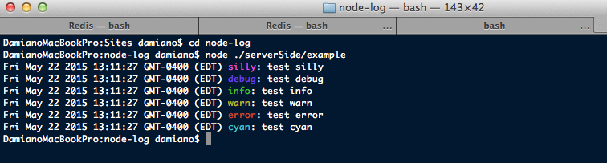
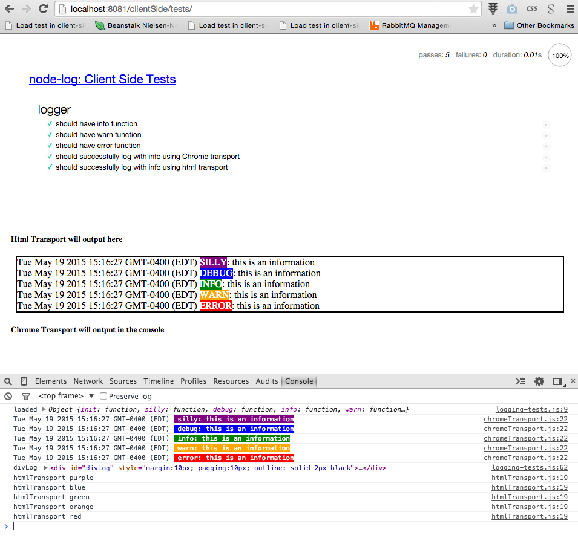

#d-log

Ultra light-weight logging module for NodeJS (and might even use on client side)

##Server side
TODO: Update readme file and add examples and screenshots (screenshot)

# Server Side example (screenshot)
 

##Client side
TODO: Update readme file and add examples

##Client side tests (screenshot)
 
